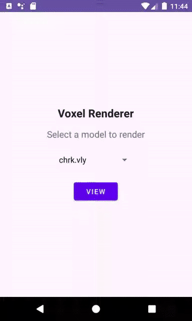

# Voxel Renderer

A simple voxel renderer app in Java and OpenGL ES

[project specs](https://git.hipert.unimore.it/ncapodieci/mobileprogramming/-/blob/89336243f620a580272150eea33d9776fb0871c0/LineeGuidaSviluppoAppCG/ProgettoCG2324.pdf)

## Technical Features
- instanced rendering (tested up to 230503 voxels!)
- zoom in / zoom out
- rotation with taps / scroll
- wireframe visualization
- Blinn-Phong lighting model
- voxel colors palette generation 
## In-depth description (ITA)
See [DOCS.md](docs/DOCS.md)

## Demo
</img>
</img>
</img>
</img>
</img>

## Acknowledgments
https://git.hipert.unimore.it/ncapodieci/mobileprogramming/ for `ShaderCompiler.java`, `PlyObject.java`, `BasicRenderer.java` and the `.vly` models.

